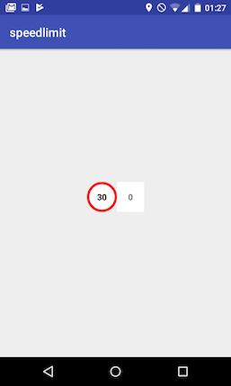
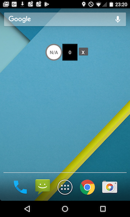

# Speed Limit Warning for Android
---

## What will we try to achieve in this tutorial?

We will explore some of the HERE APIs that will allow us to write a simple Android application which
will display our current speed and current speed limit warning on the road that we are currently on.




## Steps before we start

### Acquiring credentials for the HERE APIs

The first thing we need to do is to get credentials. 
In order to do that, lets create a HERE account and sign up for a [Freemium plan](https://developer.here.com/plans). 

After signing up, we land on the project details page, where we can generate credentials for the platforms that 
we want to develop on.  
In our case, we are interested in the HERE Mobile SDK for Android (Premium).
After entering a package name we can download the SDK.

*This flow is also described with other HERE Mobile SDK for Android examples on [Github](https://github.com/heremaps/here-android-sdk-examples).*

### Project creation

Please follow the steps described on our [documentation](https://developer.here.com/documentation/android-premium/dev_guide/topics/app-simple-android-studio.html) 
to create a template for our app with the HERE Mobile SDK.

## Step 1. Update of AndroidManifest.xml

First, please open the `AndroidManifest.xml` file and add some permissions that our app will need:
```xml
    <uses-permission android:name="android.permission.INTERNET" />
    <uses-permission android:name="android.permission.ACCESS_FINE_LOCATION" />
    <uses-permission android:name="android.permission.ACCESS_COARSE_LOCATION" />
    <uses-permission android:name="android.permission.WRITE_EXTERNAL_STORAGE" />
    <uses-permission android:name="android.permission.ACCESS_NETWORK_STATE" />
    <uses-permission android:name="android.permission.ACCESS_WIFI_STATE" />
```

*We will not focus on requesting permissions itself but the code example in the repository includes a requesting method that can be used for `SDK Version > 22`.  
More information can be found [here](https://developer.here.com/documentation/android-premium/dev_guide/topics/request-android-permissions.html)*

As you can also read in our [documentation](https://developer.here.com/documentation/android-premium/dev_guide/topics/app-run-simple.html),
you should insert the credentials that you generated into the `<application>` tag:
```xml
    <meta-data android:name="com.here.android.maps.appid" android:value="{SAMPLE_APP_ID}"/>
    <meta-data android:name="com.here.android.maps.apptoken" android:value="{SAMPLE_APP_CODE}"/>
    <meta-data android:name="com.here.android.maps.license.key" android:value="{SAMPLE_LICENSE}"/>
```

*Please read more about the service and and isolated or shared disk caches [here](https://developer.here.com/documentation/android-premium/dev_guide/topics/map-service.html)*

## Step 2. Initializing HERE Mobile SDK

The documentation section, that we used for [creating simple app](https://developer.here.com/documentation/android-premium/dev_guide/topics/app-create-simple.html) also describes how to initialize the Map Fragment.

As our application will not need a Map Fragment rendered on the UI, we will use [`MapEngine Class`](https://developer.here.com/documentation/android-premium/dev_guide/topics/class-map-engine.html), which is another way of initializing the HERE Mobile SDK.

Go to your `MainActivity` class and implement the `onCreate` method:

```java
import com.here.android.mpa.common.ApplicationContext;
import com.here.android.mpa.common.MapEngine;
import com.here.android.mpa.common.OnEngineInitListener;
 
public class MainActivity extends AppCompatActivity {
    
    @Override
    protected void onCreate(Bundle savedInstanceState) {
        super.onCreate(savedInstanceState);
        setContentView(R.layout.activity_main);

        /* 
        as mentioned before, for Android SDK Version  > 22 
        we would have to request permissions and call initSDK() when
        permissions will be granted
        */
        initSDK();

    }
    
    private void initSDK() {
        ApplicationContext appContext = new ApplicationContext(this);

        MapEngine.getInstance().init(appContext, new OnEngineInitListener() {
            @Override
            public void onEngineInitializationCompleted(Error error) {
                if (error == Error.NONE) {

                    MapEngine.getInstance().onResume();

                } else {
                    //handle error here
                }
            }
        });
    }
    
}
```

## Step 3. Initializing Positioning and Navigation Managers

The HERE Mobile SDK is now initialized, so we can enable some functionality that our application will rely on.
First, lets import the required packages:

```java
import com.here.android.mpa.common.PositioningManager;
import com.here.android.mpa.guidance.NavigationManager;
```

*More detailed information about both packages can be found in the HERE Mobile SDK for Android (Premium) [API reference](https://developer.here.com/documentation/android-premium/api_reference_java/index.html)*

```java
    private void startPositioningManager() {
        boolean positioningManagerStarted = PositioningManager.getInstance().start(PositioningManager.LocationMethod.GPS_NETWORK);

        if (!positioningManagerStarted) {
            //handle error here
        }
    }

    private void startNavigationManager() {
        NavigationManager.Error navError = NavigationManager.getInstance().startTracking();

        if (navError != NavigationManager.Error.NONE) {
            //handle error navError.toString());
        }

    }
```

At the end, when we know HERE Mobile SDK was initialized properly, lets call both methods :

```java

    private void initSDK() {
        ApplicationContext appContext = new ApplicationContext(this);

        MapEngine.getInstance().init(appContext, new OnEngineInitListener() {
            @Override
            public void onEngineInitializationCompleted(Error error) {
                if (error == Error.NONE) {

                    MapEngine.getInstance().onResume();
                    startPositioningManager();
                    startNavigationManager();

                } else {
                    //handle error here
                }
            }
        });
    }

```

## Step 4. Speed Limit Fragment

In this step we will create a class that will extend the `Fragment` class. 
Our `SpeedLimitFragment` will be responsible for the main logic of our application. 


We will be watching for the device's position updates. Based on our current position, we will then try to get information about the speed limit on the road.
To make this happen, we will define `PositioningManager.OnPositionChangedListener`:

```java
    PositioningManager.OnPositionChangedListener positionLister = new PositioningManager.OnPositionChangedListener() {
        @Override
        public void onPositionUpdated(PositioningManager.LocationMethod locationMethod,
                                      GeoPosition geoPosition, boolean b) {
                
                /* logic responsible for accessing data will go here */
                
            }
            @Override
            public void onPositionFixChanged(PositioningManager.LocationMethod locationMethod,
                                                 PositioningManager.LocationStatus locationStatus) {
        
            }
        };
```

Adding `listener` to `PositioningManager` must happen when the HERE Mobile SDK is ready.
We could add `listener` into the `onCreate` method of our `Fragment` and create it programmatically when `MainActivity` knows that the HERE Mobile SDK is ready, but to keep our example simple we will define `Fragment` directly in the template and expose the method to `MainActivity` that will be responsible for adding `listener`.

```java
    public void startListeners() {
        PositioningManager.getInstance().addListener(new WeakReference<>(positionLister));
    }
```

*More information about `PositioningManager` can be found in [User Guide](https://developer.here.com/documentation/android-premium/dev_guide/topics/map-positioning.html) and [API Reference](https://developer.here.com/documentation/android-premium/api_reference_java/index.html).*


## Step 5. Adding Fragment to Activity

First, as mentioned already, we add the `fragment` into `activity_main.xml`

```xml
<?xml version="1.0" encoding="utf-8"?>
<android.support.constraint.ConstraintLayout xmlns:android="http://schemas.android.com/apk/res/android"
    xmlns:app="http://schemas.android.com/apk/res-auto"
    xmlns:tools="http://schemas.android.com/tools"
    android:layout_width="match_parent"
    android:layout_height="match_parent"
    android:keepScreenOn="true"
    tools:context=".MainActivity">

    <fragment
        class="com.here.example.speedlimit.SpeedLimitFragment"
        android:id="@+id/speedLimitFragment"
        android:layout_width="wrap_content"
        android:layout_height="wrap_content"
        app:layout_constraintBottom_toBottomOf="parent"
        app:layout_constraintLeft_toLeftOf="parent"
        app:layout_constraintRight_toRightOf="parent"
        app:layout_constraintTop_toTopOf="parent" />

</android.support.constraint.ConstraintLayout>
```

*As we may want to use our application when driving, we added `android:keepScreenOn="true"` to our `Layout`*
  
Now that we have the `fragment` in place, we will activate its listener from `MainActivity` when the HERE Mobile SDK is initialized.

To do that, we will create a private method in `MainActivity`:
```java
    private void activateSpeedLimitFragment() {
        SpeedLimitFragment speedLimitFragment = (SpeedLimitFragment)
                getSupportFragmentManager().findFragmentById(R.id.speedLimitFragment);

        if (speedLimitFragment != null) {
            speedLimitFragment.startListeners();
        }
    }
```

And we will call it with our previously defined methods when the HERE Mobile SDK is ready:

```java

    private void initSDK() {
        ApplicationContext appContext = new ApplicationContext(this);

        MapEngine.getInstance().init(appContext, new OnEngineInitListener() {
            @Override
            public void onEngineInitializationCompleted(Error error) {
                if (error == Error.NONE) {

                    MapEngine.getInstance().onResume();
                    
                    startPositioningManager();
                    startNavigationManager();
                    activateSpeedLimitFragment();

                } else {
                    //handle error here
                }
            }
        });
    }

```

## Step 6. Adding logic into the Fragment

*As the goal of this tutorial is to explore the HERE Mobile SDK's functionality, we will skip the part responsible for the UI-related implementation of `SpeedLimitFragment`. However, the code is available in the repository.*

Let's come back to the `SpeedLimitFragment` code and the body of the `onPositionUpdated` method. 
One of the params that will be passed into the method is `geoPosition`. 
If the position is valid and if the object is a instance of `com.here.android.mpa.common.MatchedGeoPosition`, we can access the information that we are looking for:

```java
    if (geoPosition.isValid() && geoPosition instanceof MatchedGeoPosition) {

        MatchedGeoPosition mgp = (MatchedGeoPosition) geoPosition;

        double currentSpeed = mgp.getSpeed();
        double currentSpeedLimit = 0;

        if (mgp.getRoadElement() != null) {
            currentSpeedLimit = mgp.getRoadElement().getSpeedLimit();
        }

    } else {
        //handle error
    }
```
  
As the current speed and speed limit come in meters per second we also may want to format it to display as a more human-readable value:

```java
    private int meterPerSecToKmPerHour (double speed) {
        return (int) (speed * 3.6);
    }

    private int meterPerSecToMilesPerHour (double speed) {
        return (int) (speed * 2.23694);
    }
```

If you are already writing an application that uses the [HERE Map Data Download](https://developer.here.com/documentation/android-premium/dev_guide/topics/map-data.html) feature, this may be enough to achieve our goal.
In case your application does not have the `Map Data` downloaded, you may need to fetch local map data, in order to be able to access the `RoadElement`.

### Fetching data 

Let's define `prefetcherListener` in `SpeedLimitFragment` and some boolean as `Semaphore` to know when fetching is in progress:

```java
    private boolean fetchingDataInProgress = false;

    MapDataPrefetcher.Adapter prefetcherListener = new MapDataPrefetcher.Adapter() {
        @Override
        public void onStatus(int requestId, PrefetchStatus status) {
            if(status != PrefetchStatus.PREFETCH_IN_PROGRESS) {
                fetchingDataInProgress = false;
            }
        }
    };

```

Next what we should do is to add this listener to `MapDataPrefetcher`, we can do it in the `startListeners` method:

```java
    public void startListeners() {
        PositioningManager.getInstance().addListener(new WeakReference<>(positionLister));
        MapDataPrefetcher.getInstance().addListener(prefetcherListener);
    }
```

And as we want to fetch data when the position has changed, we can fetch a `GeoBoundingBox` around the device's `geoPosition`.  
This is how `onPositionUpdated` can look like:

```java
    @Override
    public void onPositionUpdated(PositioningManager.LocationMethod locationMethod,
                                  GeoPosition geoPosition, boolean b) {

        if (PositioningManager.getInstance().getRoadElement() == null && !fetchingDataInProgress) {
            GeoBoundingBox areaAround = new GeoBoundingBox(geoPosition.getCoordinate(), 500, 500);
            MapDataPrefetcher.getInstance().fetchMapData(areaAround);
            fetchingDataInProgress = true;
        }

        if (geoPosition.isValid() && geoPosition instanceof MatchedGeoPosition) {
    
            MatchedGeoPosition mgp = (MatchedGeoPosition) geoPosition;
    
            double currentSpeed = mgp.getSpeed();
            double currentSpeedLimit = 0;
    
            if (mgp.getRoadElement() != null) {
                currentSpeedLimit = mgp.getRoadElement().getSpeedLimit();                    
            }
    
        } else {
            //handle error
        }
    }
```

## What next?

This tutorial did not cover the application's life cycle and impact on used SDK objects. To learn more, read [here](https://developer.here.com/documentation/android-premium/dev_guide/topics/map-positioning.html).  
We also did not focus on UI implementation - a simple version of it is in the [repository](https://github.com/heremaps/here-android-sdk-examples/tree/master/speed-limit-watcher) (tested with HERE Mobile SDK for Android (Premium) 3.12 and Android 5 and 7.1).


The described example is ready to display the current speed and speed limit on the Activity's UI when the application starts. 
As the user may want to use other applications while driving, it makes sense to go further and possibly implement your own `Fragment` as a Floating widget, so it can always be on screen.



Happy coding!

